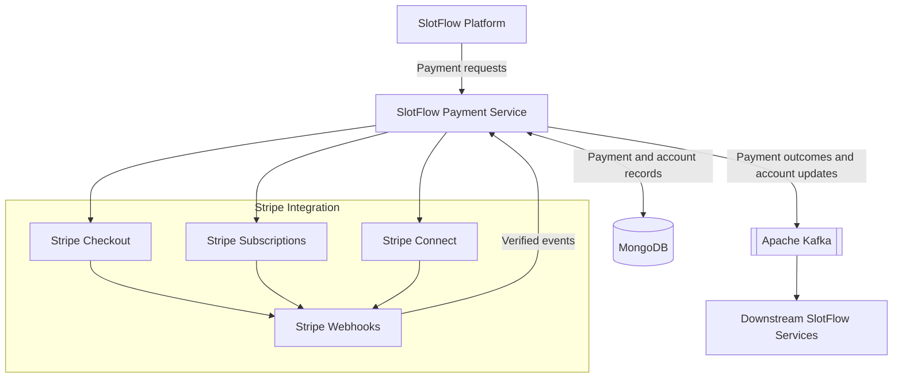

 <div>

# SlotFlow Payment Service

### Payments, simplified.

A dedicated payment microservice powering SlotFlow's appointment payments, provider subscriptions, Stripe Connect onboarding, and event-driven payment workflows.

  
  
  
  
  

---

### Live link & Repositories

  <a href="https://slotflow.online">
    
  </a>
  <a href="https://github.com/slotflow">
    
  </a>

### Technology Stack

<div align="center">
  
  
  
  
  
  
  
  
  
  
  


</div>

---

## Overview

The **SlotFlow Payment Service** is a dedicated payment microservice within the SlotFlow appointment booking platform. It manages payment operations for appointment bookings and provider subscriptions, integrating with Stripe for checkout, recurring billing, and connected-account onboarding.

The service uses MongoDB to persist payment-related records and Apache Kafka to publish payment outcomes and provider account status events to other services in the SlotFlow ecosystem.

Its payment-gateway abstraction separates payment operations from the application workflow, keeping the current Stripe integration structured for potential future support of additional payment providers.

---

## Core Features

### Appointment Payments

- One-time Stripe Checkout sessions for appointment bookings.
- Payment outcome processing through Stripe webhooks.
- Persistent payment records in MongoDB.
- Kafka events for successful and failed booking payments.

### Provider Subscriptions

- Stripe subscription checkout for service providers.
- Recurring subscription invoice payment handling.
- Successful and failed subscription payment processing.
- Kafka events for subscription payment outcomes.

### Stripe Connect

- Stripe Express connected-account creation.
- Provider onboarding links.
- Connected-account status updates.
- Tracking of account capabilities, including payout readiness.

### Stripe Webhooks

- Webhook signature verification.
- Handling of successful and failed invoice payments.
- Processing of expired checkout sessions.
- Connected-account status and authorization updates.
- Event-driven payment state synchronization.

### Event-Driven Architecture

- Apache Kafka integration for asynchronous communication.
- Payment outcome events for downstream services.
- Provider account status events.
- Kafka producer and consumer infrastructure.

### Payment Data Management

- MongoDB-backed payment records.
- Payment account data management.
- Processed-event persistence.
- Mongoose-based data modeling.

### Extensible Payment Gateway

- A dedicated payment-gateway abstraction.
- Stripe as the currently integrated payment provider.
- Separation between payment operations and application workflows.
- An architecture designed to accommodate additional gateways as the platform evolves.

---

## Technology Stack

### Runtime & Backend

<p align="left">
  
  
  
  
</p>

### Payments & Billing

<p align="left">
  
  
  
  
</p>

### Data & Messaging

<p align="left">
  
  
  
  
</p>

### Logging & Observability

<p align="left">
  
  
  
</p>

---

## Architecture

The Payment Service manages the payment lifecycle between SlotFlow and Stripe. Payment outcomes and connected-account updates are persisted in MongoDB and published through Kafka for downstream processing.



### Architecture Principles

- Dedicated microservice for payment operations.
- Payment-gateway abstraction with Stripe as the current provider.
- Separation of payment workflows from gateway integration.
- MongoDB for persistent payment-related data.
- Kafka for asynchronous communication with downstream services.
- Stripe webhooks for payment lifecycle event processing.
- Architecture designed to support future payment-provider integrations.

---

## Payment Capabilities

### Stripe Payments

The service creates one-time checkout sessions for appointment bookings and processes payment outcomes from Stripe events.

### Stripe Subscriptions

Provider subscription checkout and recurring invoice payment events are handled through Stripe Billing integration.

### Stripe Connect

The service supports connected-account onboarding for providers and tracks their account status and payout eligibility.

### Stripe Webhooks

Stripe webhooks provide event-driven updates for payment outcomes, expired checkout sessions, and connected-account changes. Webhook signatures are verified before processing.

### Payout Readiness

The service integrates with Stripe Connect account capabilities to track whether a provider's account is enabled to receive payouts. This represents payout readiness; a complete payout initiation workflow is not documented as an implemented capability.

---

## Data & Infrastructure

### MongoDB

MongoDB provides persistent storage for payment-related information.

Identified data includes:

- Payment records.
- Payment account records.
- Processed-event records.

Mongoose provides the data modeling layer.

### Apache Kafka

Kafka supports asynchronous communication between the Payment Service and other SlotFlow services.

The service publishes events related to booking payments, subscription payments, and provider account status changes.

### Stripe

Stripe provides the current payment infrastructure for:

- Appointment checkout.
- Provider subscription billing.
- Connected-account onboarding.
- Payment lifecycle webhooks.

The gateway abstraction allows the service to evolve toward a multi-provider architecture without making Stripe-specific operations the only application-level integration boundary.

---

## Project Structure

```text
slotflow-payment/
└── src/
    ├── app/
    ├── application/
    ├── config/
    ├── domain/
    ├── infrastructure/
    ├── presentation/
    ├── shared/
    ├── express.d.ts
    └── server.ts
```

---

## Observability

- **Logging:** Winston writes to the console. In development it also writes JSON logs to `logs/combined.log` and `logs/error.log`; the directory is created by the logger when needed. The configured Winston OpenTelemetry transport exports log records.
- **Traces:** The OpenTelemetry Node SDK uses Node auto-instrumentations and exports traces over OTLP/gRPC.
- **Metrics:** Metrics are exported over OTLP/gRPC every 10 seconds by the configured periodic metric reader.
- **Logs:** OpenTelemetry logs are exported over OTLP/HTTP.
- **Resource attributes:** The service name comes from `SERVICE_NAME`; the resource also includes version `1.0.0` and a development/production environment attribute.
- **Health response:** `GET /` returns a simple gateway-online JSON response. It does not check Redis, exporters, or downstream services.
- **Shutdown:** `SIGINT` and `SIGTERM` initiate OpenTelemetry shutdown and then close the HTTP server.

The receiver endpoints and any collector, metrics backend, log backend, or trace backend are externally configured. This repository does not include their deployment or dashboard configuration.

---

## Related Repositories

Only repositories with verified GitHub URLs are linked below. The backend targets correspond to services configured by this gateway; the infrastructure repository is related context and is not provisioned by this project.

<div align="center">

[](https://github.com/slotflow/slotflow-client)
[](https://github.com/slotflow/slotflow-backend-main)
[](https://github.com/slotflow/slotflow-socket)
[](https://github.com/slotflow/slotflow-payment)
[](https://github.com/slotflow/slotflow-notification)
[](https://github.com/slotflow/slotflow-infra)

</div>

---

## Project Highlights

- Dedicated payment microservice for SlotFlow.
- Stripe Checkout for appointment payments.
- Stripe Billing for provider subscriptions.
- Stripe Connect onboarding and payout-readiness tracking.
- Stripe webhook processing.
- MongoDB-backed payment data persistence.
- Kafka-based payment event publishing.
- Payment-gateway abstraction for future provider integrations.
- OpenTelemetry instrumentation and Winston logging.
- TypeScript-based Node.js implementation.

---

## License

**Proprietary — All Rights Reserved**

Copyright © 2026 SlotFlow.

The SlotFlow source code and associated assets are proprietary and confidential
property of SlotFlow.

No permission is granted to any person or organization to:

- Use the software for personal, commercial, or production purposes
- Copy, reproduce, or redistribute the source code
- Modify, adapt, or create derivative works
- Sell, sublicense, lease, or otherwise commercialize the software
- Incorporate any portion of the software into another product or service
- Host or deploy the software without explicit written permission

Viewing the source code on GitHub does not grant any license or rights to use,
modify, distribute, or commercialize the software.

Any use beyond viewing the repository requires prior written permission from
SlotFlow.

All rights reserved.

---

<div align="center">

### SlotFlow Payment Service

**Payments, simplified.**

<a href="https://slotflow.online">Live Application</a>
·
<a href="https://github.com/slotflow">GitHub Organization</a>

© 2026 SlotFlow Technologies Private Limited

</div>
